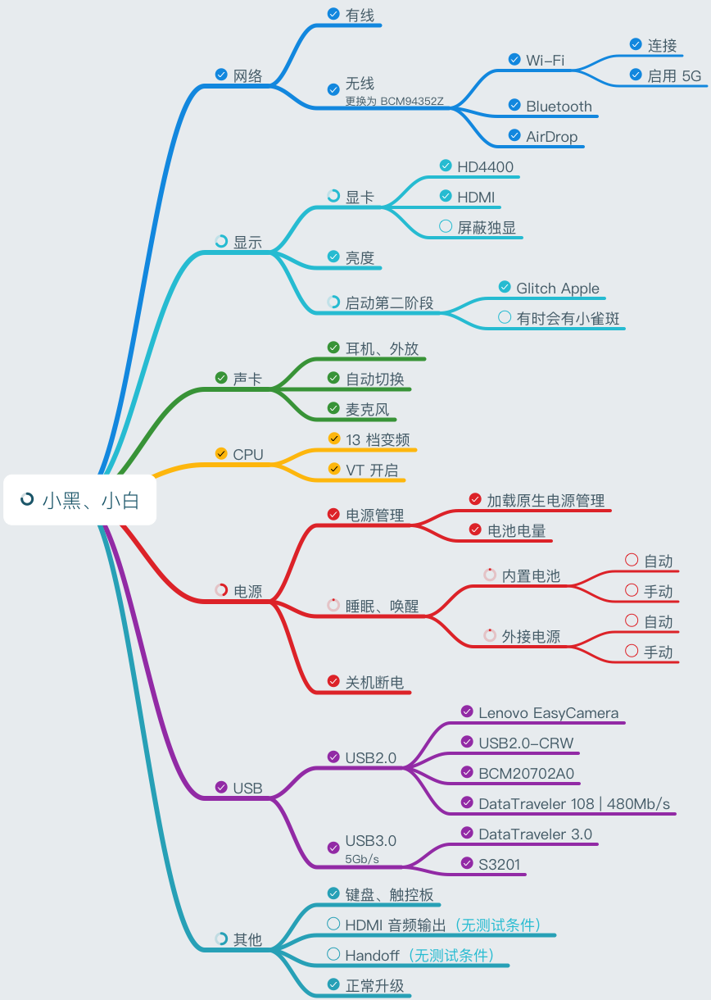

## 小黑修炼记

    修炼目标
     macOS: macOS Sierra 10.12.5
    SMBIOS: MacBookPro11,2

    使用 Vue, iView 构建的 GitHub 上 maciasl patch 的预览

## 完成进度 :open_mouth:


&nbsp;

---

[小黑原形](http://www.lenovo.com.cn/product/50081.html "LENOVO 小新 V2000 Bigger 版")如下 :sparkles:

设备 | 型号
:-: | -
主板 | Lenovo Lancer 5A5 `BIOS Version: 9BCN29WW`
主板芯片组 | Intel Lynx Point-LP `南桥`, Intel Haswell `北桥`
CPU | Intel(R) Core(TM) i7-4510U CPU @ 2.00GHz `可睿频至 3.1GHz`
集显 | Intel HD Graphics 4400 `Haswell-ULT GT2`
独显 | NVIDIA GeForce 840M
声卡 | Conexant CX20751/2
有线 | Realtek RTL8168/8111 PCI-E `Realtek RTL8168GU`
无线和蓝牙| Intel 3160 AC &nbsp;--<sup>更换为</sup>-->&nbsp; Broadcom BCM4352 802.11AC
触控板 | ELAN

---

## [制作 macOS U盘](https://www.tonymacx86.com/threads/unibeast-install-macos-sierra-on-any-supported-intel-based-pc.200564/#create_unibeast)


## [BIOS 设置](https://www.tonymacx86.com/threads/unibeast-install-macos-sierra-on-any-supported-intel-based-pc.200564/#uefi_settings)
> 1. To access BIOS/UEFI Setup, press and hold Delete on a USB Keyboard while the system is booting up
> 2. Load Optimized Defaults
> 3. If your CPU supports VT-d, disable it
> 4. If your system has CFG-Lock, disable it
> 5. If your system has Secure Boot Mode, disable it
> 6. Set OS Type to Other OS
> 7. If your system has IO SerialPort, disable it
> 8. Set XHCI Handoff to Enabled
> 9. If you have a 6 series or x58 system with AWARD BIOS, disable USB 3.0
> 10. Save and exit.


## DSDT/SSDTs 修改
-   **[Patching LAPTOP DSDT/SSDTs](https://www.tonymacx86.com/threads/guide-patching-laptop-dsdt-ssdts.152573/)**  
    工具:
    :one:[iasl](https://bitbucket.org/RehabMan/acpica/downloads/)
    :two:[patchmatic](https://bitbucket.org/RehabMan/os-x-maciasl-patchmatic/downloads/)
    :three:[MaciASL](https://bitbucket.org/RehabMan/os-x-maciasl-patchmatic/downloads/)

    本例的 DSDT/SSDTs，由 patchmatic 在只有 FakeSMC.kext 与 config.list 空白的情形下提取而来

-   **首要**  
    + DSDT.dsl
    ```
    "Rename _DSM methods to XDSM"   ==> rename_DSM.txt
    "IRQ Fix"                       ==> system_IRQ.txt
    "SMBUS Fix"                     ==> system_SMBUS.txt
    "RTC Fix"                       ==> system_RTC.txt
    "OS Check Fix (Windows 8)"      ==> system_OSYS_win8.txt
    "AC Adapter Fix"                ==> system_ADP1.txt
    "Fix _WAK Arg0 v2"              ==> system_WAK2.txt
    "Add IMEI"                      ==> system_IMEI.txt

    "Rename GFX0 to IGPU"           ==> graphics_Rename-GFX0.txt
    "Rename B0D3 to HDAU"           ==> graphics_Rename-B0D3.txt（有修改）

    "USB3 _PRW 0x6D (instant wake)" ==> usb_prw_0x6d_xhc.txt    （有修改）
    ```
    + SSDT*.dsl
    ```
    "Rename _DSM methods to XDSM"   ==> rename_DSM.txt
    "Rename GFX0 to IGPU"           ==> graphics_Rename-GFX0.txt
    "Rename B0D3 to HDAU"           ==> graphics_Rename-B0D3.txt（有修改）
    ```

-   **有线**  
    `Realtek RTL8168GU`  
    驱动文件: [RealtekRTL8111.kext](https://bitbucket.org/RehabMan/os-x-realtek-network/downloads)

-   ***无线*** :ghost:  
    *`Broadcom BCM4352 802.11AC (BCM94352Z)`*  
    在 Windows 系统中 [移除白名单](https://www.tonymacx86.com/threads/guide-lenovo-g50-70-and-z50-70-bios-whitelist-removal.187340/)
    之后，更换新无线网卡  
    驱动文件:
    [FakePCIID_Broadcom_WiFi.kext](https://bitbucket.org/RehabMan/os-x-fake-pci-id/downloads)
    `依赖 FakePCIID.kext`

    > **Broadcom WiFi BCM94352 requires additional patches**
    >
    > The patch was created by the-darkvoid.
    >
    > eg. in KextsToPatch:  
    > Comment: AirPortBrcm4360 - fcvo, 10.12.x (credit the-darkvoid)  
    > MatchOS: 10.12.x  
    > Name: AirPortBrcm4360  
    > Find: <81f952aa 00007529>  
    > Replace: <81f952aa 00006690>
    >
    > Additional background: [insanelymac](http://www.insanelymac.com/forum/topic/312759-fix-macos-sierra-dp1-bcm94532z-wifi/)

-   ***蓝牙***  
    驱动文件:
      [BrcmFirmwareData.kext](https://bitbucket.org/RehabMan/os-x-brcmpatchram/downloads)
    , [BrcmPatchRAM2.kext](https://bitbucket.org/RehabMan/os-x-brcmpatchram/downloads)

-   **显卡**  
    `Intel HD4400, Haswell-ULT GT2`  

    * 注入集显 device-id, ig-platform-id  
    修改的表: `SSDT-3.dsl`  
    参考补丁: `[igpu] Haswell HD4400/HD4600/HD5000`  
    完成补丁: [:page_facing_up:](patches/graphics_Haswell_0a260006.txt) `有修改`

        id 获取:
          [tonymacx86](https://www.tonymacx86.com/threads/fix-intel-hd4200-hd4400-hd4600-mobile-on-yosemite.145427/)
        | [pcbeta](http://bbs.pcbeta.com/viewthread-1465761-1-1.html)

    * 屏蔽独显  
    修改的表: `DSDT.dsl`  
    参考补丁: `[gfx0] Disable from _REG (DSDT)`  
    &nbsp;&nbsp;&nbsp;&nbsp;&nbsp;&nbsp;&nbsp;&nbsp;&nbsp;&nbsp;&nbsp;&nbsp;&nbsp;&nbsp;&nbsp;
             `[gfx0] Disable/Enable on_WAK/_PTS (DSDT)`  
    完成补丁: [:page_facing_up:](patches/graphics_disable_nv.txt)

-   **亮度**  
    修改的表: `SSDT-3.dsl`  
    参考补丁: `[igpu] Brightness fix (Haswell/Broadwell)`  
    完成补丁: [:page_facing_up:](patches/graphics_PNLF_haswell.txt)

    驱动制作:
    [修复 macOS 10.12.4 版本的亮度](https://www.tonymacx86.com/threads/guide-laptop-backlight-control-using-applebacklightinjector-kext.218222/)
    `获得制作的文件 •SSDT-PNLF.aml •AppleBacklightInjector.kext`

    > **Brightness requires additional patches**  
    >
    > The patch was created by RehabMan.
    >
    > eg. in KextsToPatch:  
    > Comment: change F%uT%04x to F%uTxxxx in AppleBacklightInjector.kext (credit RehabMan)  
    > Name: com.apple.driver.AppleBacklight  
    > Find: <46257554 25303478 00>  
    > Replace: <46257554 78787878 00>
    >
    > Additional background of *Installation*: [tonymacx86](https://www.tonymacx86.com/threads/guide-laptop-backlight-control-using-applebacklightinjector-kext.218222/)

-   **声卡**  
    `Conexant CX20751/2`  
    修改的表: `DSDT.dsl`  
    参考补丁: `[audio] Audio Layout 12`  
    完成补丁: [:page_facing_up:](patches/audio_HDEF-layout.txt) `有修改`

    layout-id: [github](https://github.com/vit9696/AppleALC/wiki/Supported-codecs)

    驱动文件:
      [AppleALC](https://github.com/vit9696/AppleALC)
    , [Lilu](https://github.com/vit9696/Lilu)
    > AppleALC 1.1.1 : Requires Lilu 1.1.0 or newer  
    > AppleALC 1.1.0 : AppleALC now has its kernel patcher moved to Lilu.kext  
    > AppleALC 1.0.19: Added Conexant CX20751_2 HDMI/DisplayPort Output fix by syscl

-   **睿频**  
    `Intel i7-4510U CPU @ 2.00GHz Turbo 3.1GHz`  
    脚本: [ssdtPRGen.sh](https://github.com/Piker-Alpha/ssdtPRGen.sh)

-   **电池**  
    修改的表: `DSDT.dsl`  
    参考补丁: `[bat] Lenovo Z50-70`  
    完成补丁:
      RehabMan [:page_facing_up:](patches/battery_Lenovo-Z50-70.txt)
    | 自己制作 [:page_facing_up:](patches/battery_Lenovo-v2000.txt)  
    驱动文件: [ACPIBatteryManager.kext](https://bitbucket.org/RehabMan/os-x-acpi-battery-driver/downloads/)

    补丁制作:
      [tonymacx86](https://www.tonymacx86.com/threads/guide-how-to-patch-dsdt-for-working-battery-status.116102/)
    | [pcbeta](http://bbs.pcbeta.com/viewthread-1521462-1-1.html)
      `(后者为前者的中译版)`

-   **USB、睡眠、唤醒**  
    我想已经正常工作了 :wink:

-   **键盘、触摸板**  
    `ELAN`  
    驱动文件:
    [ApplePS2SmartTouchPad.kext](http://forum.osxlatitude.com/index.php?/topic/1948-elan-focaltech-and-synaptics-smart-touchpad-driver-mac-os-x/)

---

-   **还需要的其它驱动 by RehabMan**  

Relative Devices | Drive name | URL
:------:| ---------------------------------- | ---------------------------------
System  | FakeSMC.kext                       | [bitbucket](https://bitbucket.org/RehabMan/os-x-fakesmc-kozlek/downloads/)
System  | • FakePCIID.kext                   | [bitbucket](https://bitbucket.org/RehabMan/os-x-fake-pci-id/downloads/)
GPU     | • FakePCIID_Intel_HD_Graphics.kext | ibid.
HD-Audio| • FakePCIID_Intel_HDMI_Audio.kext  | ibid.
USB     | • FakePCIID_XHCIMux.kext           | ibid.
GPU     | IntelGraphicsFixup.kext            | [bitbucket](https://bitbucket.org/RehabMan/intelgraphicsfixup/downloads/)
USB     | GenericUSBXHCI.kext                | [bitbucket](https://bitbucket.org/RehabMan/os-x-generic-usb3/downloads/)
USB     | USBInjectAll.kext                  | [bitbucket](https://bitbucket.org/RehabMan/os-x-usb-inject-all/downloads/)

---

&nbsp;

#### Bad Apple
> **Graphics boot glitch patch for 10.12**
>
> A new patch is required.
>
> eg. in KextsToPatch:  
> Comment: Boot graphics glitch, 10.12.dp1 (credit denskop)  
> MatchOS: 10.12.x  
> Name: IOGraphicsFamily  
> Find: <01000075 25>  
> Replace: <010000eb 25>
>
> Read also here for further information/tips: [tonymacx86](https://www.tonymacx86.com/threads/fix-resolve-boot-screen-garble.175799/)
>
> For those too lazy to read, keep in mind:  
> \- the glitch fix does not remove the glitch entirely... it only reduces the severity  
> \- the glitch fix is most effective if CSM/legacy boot is enabled in BIOS

&nbsp;

#### 同步 Windows 与 macOS 时间
在 Windows 系统中，以管理员身份运行 CMD 执行下面的命令 `最简便的方法`  
```cmd
reg add HKLM\SYSTEM\CurrentControlSet\Control\TimeZoneInformation /v RealTimeIsUniversal /t REG_DWORD /d 1
```

&nbsp;

The end. Enjoy :innocent:

&nbsp;


