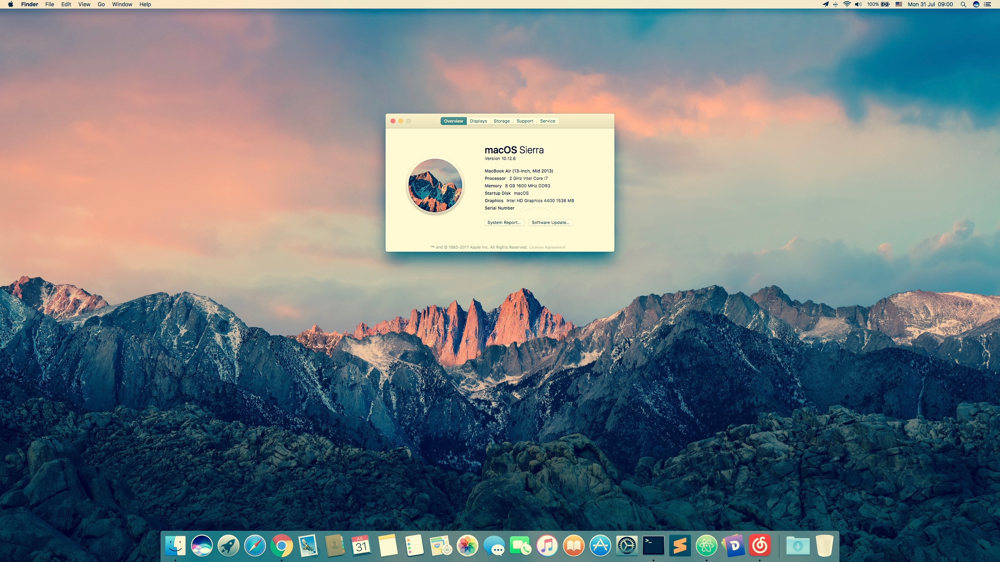

## 小黑修炼记

本文旨在阐述『小黑』、『小白』多重境界的修炼，望有所助益  
另附，以 Vue、iView 构建的 GitHub 上 maciasl patch 的预览

    修炼境界
     macOS: macOS Sierra 10.12.6
    SMBIOS: MacBookAir6,2

[小黑](http://www.lenovo.com.cn/product/50081.html "LENOVO 小新 V2000 Bigger 版") | 示下
:-: | -
主板 | Lenovo Lancer 5A5 `BIOS Version: 9BCN29WW`
主板芯片组 | Intel Lynx Point-LP `南桥`, Intel Haswell `北桥`
CPU | Intel(R) Core(TM) i7-4510U CPU @ 2.00GHz `可睿频至 3.1GHz`
集显 | Intel HD Graphics 4400 `Haswell-ULT GT2`
独显 | NVIDIA GeForce 840M
声卡 | Conexant CX20751/2
有线 | Realtek RTL8168/8111 PCI-E `Realtek RTL8168GU`
无线和蓝牙| Intel 3160 AC &nbsp;--<sup>更换为</sup>-->&nbsp; Broadcom BCM4352 802.11AC
触控板 | ELAN

## 修炼途径
- Ⓐ [热修补](patch_hotpatch.md)
- Ⓑ [动手做](patch_static.md)

**提示**：如果你已拥有与 Ⓐ 法现有 hotpatch 对应的相同设备，即可以此法修炼，否则请以 Ⓑ 法修炼，切记。

## 同步 Windows 与 macOS 时间
在 Windows 系统中，以管理员身份运行 CMD 执行下面的命令 `最简便的方法`
```cmd
reg add HKLM\SYSTEM\CurrentControlSet\Control\TimeZoneInformation /v RealTimeIsUniversal /t REG_DWORD /d 1
```

&nbsp;

The end. Enjoy :innocent:

&nbsp;



&nbsp;

---

&nbsp;

## 项目文件
    .
    ├── README.md
    ├── build
    │   ├── build.js
    │   ├── check-versions.js
    │   ├── dev-client.js
    │   ├── dev-server.js
    │   ├── utils.js
    │   ├── vue-loader.conf.js
    │   ├── webpack.base.conf.js
    │   ├── webpack.dev.conf.js
    │   └── webpack.prod.conf.js
    ├── config
    │   ├── dev.env.js
    │   ├── index.js
    │   └── prod.env.js
    ├── index.html
    ├── package.json
    ├── patch_hotpatch.md
    ├── patch_static.md
    ├── patches
    │   ├── README.md
    │   ├── Replace Names.txt
    │   ├── audio_HDEF-layout.txt
    │   ├── battery_Lenovo-Z50-70.txt
    │   ├── battery_Lenovo-v2000.txt
    │   ├── fix_PSS.txt
    │   ├── graphics_Haswell_0a260006.txt
    │   ├── graphics_PNLF_haswell.txt
    │   ├── graphics_Rename-B0D3.txt
    │   ├── graphics_Rename-GFX0.txt
    │   ├── misc_Haswell-LPC.txt
    │   ├── rename_DSM.txt
    │   ├── system_ADP1.txt
    │   ├── system_IMEI.txt
    │   ├── system_IRQ.txt
    │   ├── system_OSYS_win8.txt
    │   ├── system_RTC.txt
    │   ├── system_SMBUS.txt
    │   ├── system_WAK2.txt
    │   └── usb_prw_0x6d_xhc.txt
    ├── progress
    ├── src
    │   ├── Maciasl.vue
    │   ├── components
    │   │   ├── Breadcrumb.vue
    │   │   ├── Clipboard.vue
    │   │   ├── Context.vue
    │   │   ├── Loading.vue
    │   │   ├── MaciaslMenu.vue
    │   │   └── maciasl.json
    │   └── main.js
    ├── static
    └── whoami.jpg
